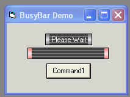



## My Busy Bar user control \(Update\)

### Description

Just something I was playing around with. If you can use it, great, but the most important thing is to have fun while coding.7-28-07 Added caption and Ole_Color options
 
### More Info
 

             |
---                |---
**Submitted On**   |2007-07-28 08:48:38
**By**             |[Kenneth Foster](https://github.com/Planet-Source-Code/PSCIndex/blob/master/ByAuthor/kenneth-foster.md)
**Level**          |Intermediate
**User Rating**    |4.5 (18 globes from 4 users)
**Compatibility**  |VB 6\.0
**Category**       |[Miscellaneous](https://github.com/Planet-Source-Code/PSCIndex/blob/master/ByCategory/miscellaneous__1-1.md)
**World**          |[Visual Basic](https://github.com/Planet-Source-Code/PSCIndex/blob/master/ByWorld/visual-basic.md)
**Archive File**   |[My\_Busy\_Ba2077347282007\.zip](https://github.com/Planet-Source-Code/kenneth-foster-my-busy-bar-user-control-update__1-69046/archive/master.zip)

